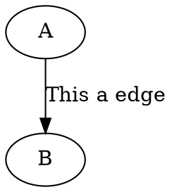

# 背景

>Graphviz 是一个由 AT&T 实验室启动的使用 DOT 语言来绘制关系图/流程图的开源工具包。
>DOT 语言是一种文本图形描述语言，它提供了一种简单的描述图形的方法。
>使用 Graphviz，我们只需要将精力集中在逻辑设计上，而不需要花费大量时间在图形布局的调整上，图形绘制布局都由工具引擎来搞定。也因此，需要精确定位的图形就不适合用 Graphviz 来绘制了。另外，文本代码绘制图形的方式也便于版本管理。

# 安装

在[官网](http://www.graphviz.org/)下载对应版本，当前最新的稳定版本是 2.3.8 ，已经将近四年年没有更新过。

安装完毕后，windows平台下，将 `(安装目录)\Graphviz2.38\bin` 加入系统环境变量 PATH 中。

打开输入命令行提示符，输入 `dot -V`，若出现 `dot - graphviz version 2.38.0 (20140413.2041)` 说明配置成功，可以开始我们的绘制之旅。

# 上手

新建一个 learn.dot，输入我们的第一个程序



命令行下输入

```bash
dot -Tpng learn.dot -o learn.png
```

查看 learn.png ，内容如下：


这是我们生成的第一个图片，我们来仔细介绍一下。

__digraph __

表明这个图是有向图。

___simple_demo __

图的名称，一个图必须要有名称。

__NodeA/NodeB__

节点的内部名称，如果没有指定 label 参数，则会出现在最终图片中。

__label__

label 是节点的外部名称，用双引号括起。

__->__

有向边，从 NodeA 指向 NodeB。

上面的简单例子，给我们展示了 Dot 的语法是十分便于人类理解的，十分的自然。同时揭示了 Dot 语言组成的三个要素：图、节点、边。

# 支持中文

使用dot程序生成带有汉字信息的图片，需要注意两点，否则生成的图片中汉字会被显示为乱码：

1. 文件应使用UTF-8编码保存，而不是Windows默认的ANSI编码。
2. 字体应指定为支持汉字的字体，如宋体为SimSun。
3. 为了让显示方便更优，中文字符串左右两边应该各留一个空格。

# 常用属性

对于各种结构的通用属性如下：

| 属性名称 | 默认值 | 含义 |
| --- | --- | --- |
| color | black | 颜色，颜色设置支持形如`red`和`#FF0000`两种形式 |
| fontcolor | black | 文字颜色 |
| fontname | Times-Roman | 字体 |
| fontsize | 14 | 文字大小 |
| label |   | 显示的标签，支持'\n'换行，对于节点默认为节点名称 |
| penwidth | 1.0 | 线条宽度 |
| style |   | 样式 |

常用图属性如下：

| 属性名称 | 默认值 | 含义 |
| --- | --- | --- |
| bgcolor |   | 背景颜色 |
| concentrate | false | 是否允许多条边有公共部分 |
| nodesep | .25 | 节点之间的间隔（英寸） |
| peripheries | 1 | 边界数 |
| rank |   | same,min,source, max,sink，设置多个节点顺序 |
| rankdir | TB | 排序方向 可选值有：TB LR BT RL |
| ranksep | .75 | 间隔 |
| size |   | 图的大小（英寸），如："2,2" |
| labelloc |   | 调整图或子图的标签的上下位置 |
| labeljust |   | 调整图或子图的标签的左右位置 |
| compound | false | 如果为`true`，允许边从子图两边接入，配合`lhead`和`ltail`使用 |

常用节点属性如下：

| 属性名称 | 默认值 | 含义 |
| --- | --- | --- |
| shape | ellipse | 形状 |
| sides | 4 | 当shape=polygon时的边数 |
| fillcolor | lightgrey/black | 填充颜色 |
| fixedsize | false | 是否让标签影响节点的大小 |

常用边属性如下：

| 属性名称 | 默认值 | 含义 |
| --- | --- | --- |
| arrowhead | normal | 箭头头部形状 |
| arrowsize | 1.0 | 箭头大小 |
| arrowtail | normal | 箭头尾部形状 |
| constraint | true | 是否根据边来影响节点的排序 |
| decorate |   | 设置之后会用一条线来连接edge和label |
| dir | forward | 设置方向：forward,back,both,none |
| headclip | true | 是否到边界为止 |
| tailclip | true | 与headclip类似 |
| headlabel |   | 边的头部显示的标签 |
| taillabel |   | 边的尾部显示的标签 |
| weight | 1 | 边的权重，越大越粗 |
| lhead |   | 当`compound`为true时，lhead用于指定边指向的cluster |
| ltail |   | 与ltail类似 |

# 布局引擎与输出格式

我们在之前的输出文件命令，

```bash
dot -Tpng learn.dot -o learn.png
```

其中 learn.dot 是我们的源文件， 
-o learn.png 指明了我们输出的目标文件名为 learn.png，
-Tpng 则指明了图片格式用的是png。

其实我们也可以拓展该命令，改为：

```bash
dot -Kdot -Tpng learn.dot -o learn.png
```

其中 -Kdot 表示使用 dot 布局。

Graphviz支持几种布局引擎：

* dot：默认布局方式，主要用于有向图
* neato：主要用于无向图
* twopi：主要用于径向布局
* circo：圆环布局
* fdp：主要用于无向图
* sfdp：主要绘制较大的无向图
* patchwork：主要用于树哈希图（tree map）

Graphviz支持的输出图片格式更是相当的多，常用的有以下几种：

* pdf
* gif
* png
* jpeg
* bmp
* svg（矢量图，一般用与Web，可以用浏览器打开）
* ps（矢量线图，多用于打印）

更多的输出格式可以浏览 Graphviz 输出格式进行查看。

---

# 引用

1. https://blog.csdn.net/sd10086/article/details/52979462/
2. https://www.cnblogs.com/taceywong/p/5439574.html
3. http://www.360doc.com/content/16/0619/00/9482_568900997.shtml