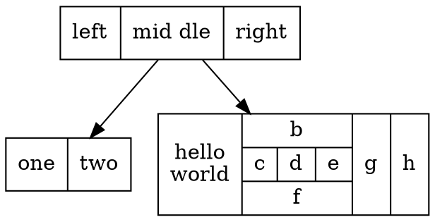
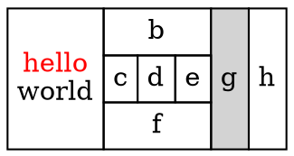
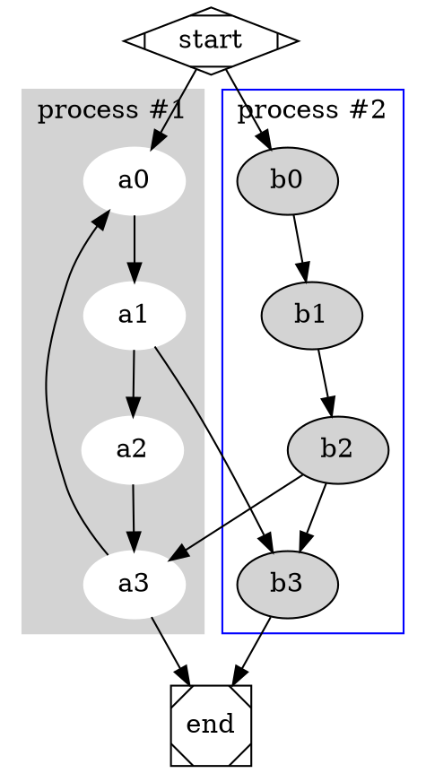
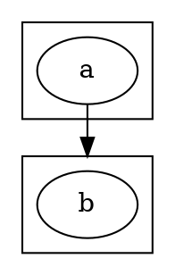

# 批量多边

一对多：
 节点文字内容->{节点文字内容 ;节点文字内容 ;节点文字内容 }
 如：a->{b;c;d}

多对一：
{节点文字内容 ; 节点文字内容 ; 节点文字内容}->节点文字内容
如：{b;c;d}->a

同样的也有多对多。

# 颜色名称列表


# 形状名称列表


# 设置两节点间边的方向

节点文字内容>节点文字内容[dir = 方向名称]
如：a->b[dir=both]、a--b[dir=back]。

4个系统方向名称：
1. both（a<->b）
2. none(a--b)
3. back(a<-b)
4. forward(a->b)

有向图中默认为forward，无向图中默认为none。

# 复杂结构


上图的结构十分复杂， Graphviz 依然可以画出，源码如下：




Graphviz 中的 label 标签还支持 Html 格式，上图可以用下面混入 html 的代码画出：



# 子图

在dot中以cluster开头的子图会被当做是一个新的布局来处理，而不是在原图的基础上继续操作。


上图是个流程图，值得注意的是子图一定用 subgraph 声明，且图名称前面一定要带有 cluster 这个关键词。



如果我们想直接指向子图怎么办，我们要设置 compound 为true，并配合 lhead 或 ltail 来实现。




# 以图片为节点

节点还可以使用图片，通过在节点中使用 `image="image_path"` 来设置图片。不过需要注意的是，在使用图片作为节点的时候，需要将本来的形状设置为 none，并且将 label 置为空字符串，避免出现文字对图片的干扰。

# python 调用

除了可以使用 dot 文件编写图形外，也可以使用python编写相关的代码，生成图形文件。
安装 python 对应的 graphviz 相应的模块：

```bash
pip install pygraphviz
```

一个实例：

```python
# 引用 pygraphviz
import pygraphviz as pgv
# 初始化图类
G = pgv.AGraph()
# 增加节点和边
G.add_node('a')       # adds node 'a'
G.add_edge('b','c')   # adds edge 'b'-'c' (and also nodes 'b', 'c')
# 设置属性
G.graph_attr['label'] = 'test graphf'
G.node_attr['shape'] = 'circle'
G.edge_attr['color'] = 'red'
# 设置输出的格式
G.layout()              # default to neato
G.layout(prog='dot')    # use do
# 输出到文件
G.draw('file.png')              # write previously positioned graph to PNG file
G.draw('file.ps',prog='circo')  # use circo to position, write PS file
```

---

# 引用

1. https://blog.csdn.net/sd10086/article/details/52979462/
2. https://www.cnblogs.com/taceywong/p/5439574.html
3. https://www.jianshu.com/p/5b02445eca1d
4. https://www.cnblogs.com/liang1101/p/7641984.html